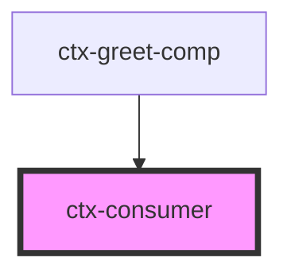

# ctx-consumer

<!-- Auto Generated Below -->

## Properties

| Property            | Attribute | Description | Type                   | Default                  |
| ------------------- | --------- | ----------- | ---------------------- | ------------------------ |
| `mapper`            | --        |             | `(val: any) => string` | `(val: any) => `${val}`` |
| `name` _(required)_ | `name`    |             | `string`               | `undefined`              |

## Dependencies

### Used by

 - [ctx-greet-comp](../ctx-greet-comp)

### Graph

----------------------------------------------

*Built with [StencilJS](https://stenciljs.com/)*
